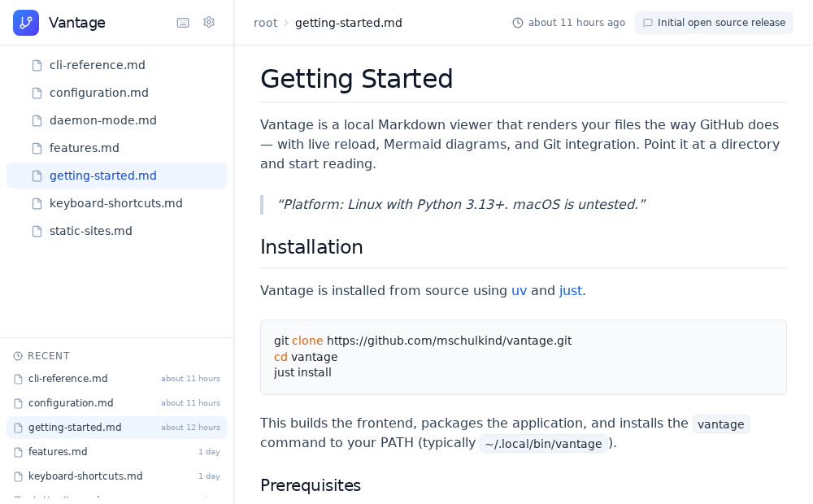

# Vantage 🔭

[](https://github.com/mschulkind/vantage/actions/workflows/ci.yml)

**A beautiful local Markdown viewer with live reload and Git awareness.**

[Website](https://vantageapp.dev) · [GitHub](https://github.com/mschulkind/vantage) · [Issues](https://github.com/mschulkind/vantage/issues)



Vantage renders your Markdown files the way GitHub does — locally, instantly, with live reload as you edit. Point it at one directory or several, and browse your docs in a polished web UI with file tree navigation, Mermaid diagrams, commit history, and diffs.

Built for developers who write docs alongside code — especially useful for reviewing LLM-generated Markdown output in real time.

> **Platform:** Linux. macOS is untested and unsupported. Windows is not supported.

---

## ✨ Features

- **GitHub-Style Rendering** — Full GitHub Flavored Markdown with syntax highlighting, tables, task lists, and footnotes
- **Mermaid Diagrams** — Renders Mermaid diagrams inline from fenced code blocks
- **Live Reload** — Files update instantly in the browser via WebSocket when modified on disk
- **Git Integration** — View commit history, diffs, and file status for any file
- **Multi-Repo Mode** — Serve multiple directories from a single daemon, each accessible by name
- **File Tree Navigation** — Lazy-loaded sidebar with directory expansion
- **Frontmatter Support** — Displays YAML frontmatter as a clean metadata table
- **Keyboard Shortcuts** — Quick file picker with `t`, fuzzy search, keyboard navigation
- **systemd Service** — Run as a background service that starts on login

---

## 📦 Installation

Vantage requires **Python 3.13+** and is installed as a CLI tool using [uv](https://docs.astral.sh/uv/).

```bash
# Install from source
git clone https://github.com/mschulkind/vantage.git
cd vantage

# Build and install (includes the frontend)
just install
```

This makes the `vantage` command available in your PATH (typically `~/.local/bin/vantage`).

### Prerequisites

| Tool                               | Purpose                                 |
| ---------------------------------- | --------------------------------------- |
| [uv](https://docs.astral.sh/uv/)   | Python package manager                  |
| [Node.js 22+](https://nodejs.org/) | Building the frontend                   |
| [just](https://just.systems/)      | Command runner (optional, for building) |

---

## 🚀 Quick Start

### Single Directory

Point Vantage at any directory containing Markdown files:

```bash
vantage serve ~/Documents/notes
```

Open **http://localhost:8000** in your browser.

### Multiple Directories (Daemon Mode)

To serve several directories at once, create a config and run the daemon:

```bash
# Generate a config file
vantage init-config

# Edit it
$EDITOR ~/.config/vantage/config.toml

# Start the daemon
vantage daemon
```

---

## ⚙️ Configuration

The config file lives at `~/.config/vantage/config.toml`. Generate one with:

```bash
vantage init-config
```

### Example Config

```toml
# Server settings
host = "127.0.0.1"
port = 8000

# Directories to serve (each appears in the sidebar)
[[repos]]
name = "notes"
path = "~/Documents/notes"

[[repos]]
name = "work-docs"
path = "~/work/documentation"

[[repos]]
name = "project"
path = "~/code/my-project"
```

Each repo is accessible at `http://localhost:8000/{name}/`.

### Configuration Reference

| Key            | Type             | Default       | Description                                 |
| -------------- | ---------------- | ------------- | ------------------------------------------- |
| `host`         | string           | `"127.0.0.1"` | Server bind address                         |
| `port`         | integer          | `8000`        | Server port                                 |
| `repos[].name` | string           | _required_    | Display name and URL slug for the directory |
| `repos[].path` | string           | _required_    | Path to directory (supports `~`)            |
| `exclude_dirs` | array of strings | _(see below)_ | Directories to hide from file listings      |

### Excluded Directories

By default, Vantage hides common build/dependency directories from the sidebar, file picker, and recent files:

`node_modules`, `.venv`, `venv`, `__pycache__`, `.pytest_cache`, `.mypy_cache`, `.ruff_cache`, `.egg-info`, `.tox`, `.nox`, `dist`, `build`, `.cache`, `.git`, `.hg`, `.svn`

Override this in your config:

```toml
exclude_dirs = ["node_modules", ".venv", "vendor", "dist"]
```

---

## 🔧 Service Management (Linux)

Vantage can run as a systemd user service that starts automatically on login.

### Install the Service

```bash
vantage install-service
```

### Enable and Start

```bash
systemctl --user daemon-reload
systemctl --user enable vantage
systemctl --user start vantage
```

### Common Commands

```bash
# Check status
systemctl --user status vantage

# View logs
journalctl --user -u vantage -f

# Restart after config changes
systemctl --user restart vantage

# Stop the service
systemctl --user stop vantage
```

### Keep Running After Logout

By default, user services stop when you log out. To keep Vantage running:

```bash
loginctl enable-linger $USER
```

---

## 🖥️ CLI Reference

```
vantage                          # Start server (alias for 'serve .')
vantage serve [PATH]             # Serve a single directory
vantage daemon                   # Serve multiple directories from config
vantage daemon -c /path/to.toml  # Use a custom config file
vantage init-config              # Generate example config file
vantage install-service          # Install systemd user service
vantage build PATH -o OUTPUT     # Build a static site
```

---

## 🔌 API

Vantage exposes a REST API for programmatic access.

### Single-Repo Endpoints

| Endpoint                                    | Description             |
| ------------------------------------------- | ----------------------- |
| `GET /api/tree?path=.`                      | File tree listing       |
| `GET /api/content?path=file.md`             | File content            |
| `GET /api/git/history?path=file.md`         | Commit history          |
| `GET /api/git/diff?path=file.md&commit=SHA` | Diff for a commit       |
| `GET /api/files`                            | List all Markdown files |

### Multi-Repo Endpoints

In daemon mode, endpoints are prefixed with `/api/r/{repo}/`:

| Endpoint                                 | Description                  |
| ---------------------------------------- | ---------------------------- |
| `GET /api/repos`                         | List configured repositories |
| `GET /api/r/{repo}/tree?path=.`          | File tree for a repo         |
| `GET /api/r/{repo}/content?path=file.md` | File content for a repo      |

---

## 🛠️ Development

See [docs/development.md](docs/development.md) for instructions on building, testing, and contributing to Vantage.

---

## 📄 License

Apache 2.0 — see [LICENSE](LICENSE).
