# Mermaid Diagrams Test Document

This document contains various Mermaid diagrams for testing the rendering capabilities of Vantage.

## Flowchart

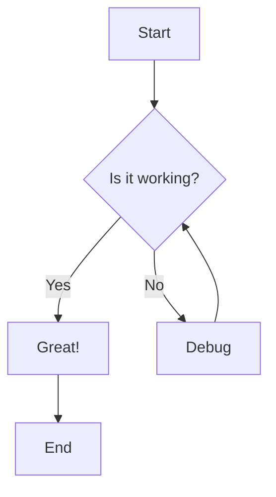

## Sequence Diagram

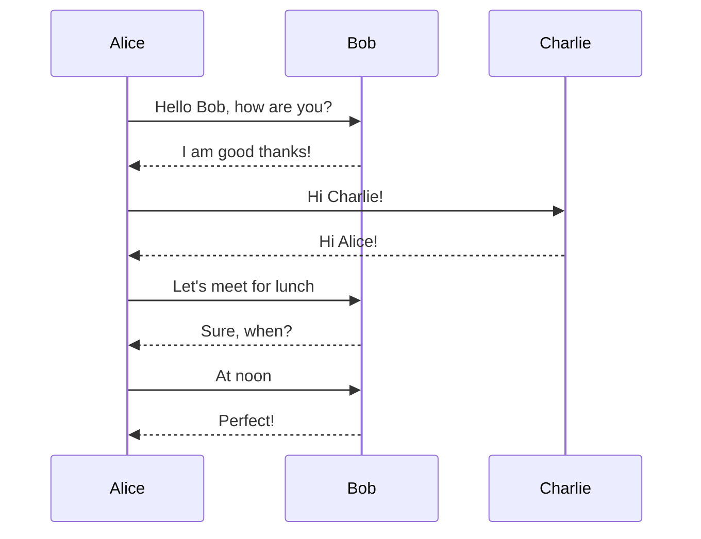

## Gantt Chart

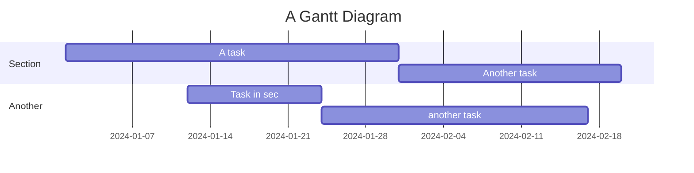

## Pie Chart

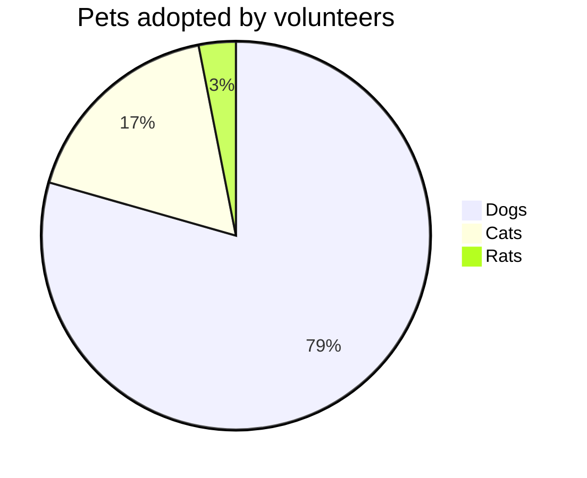

## State Diagram

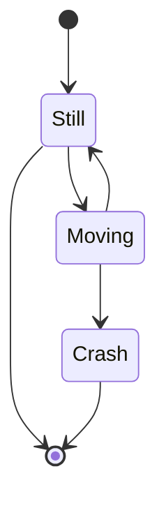

## Class Diagram

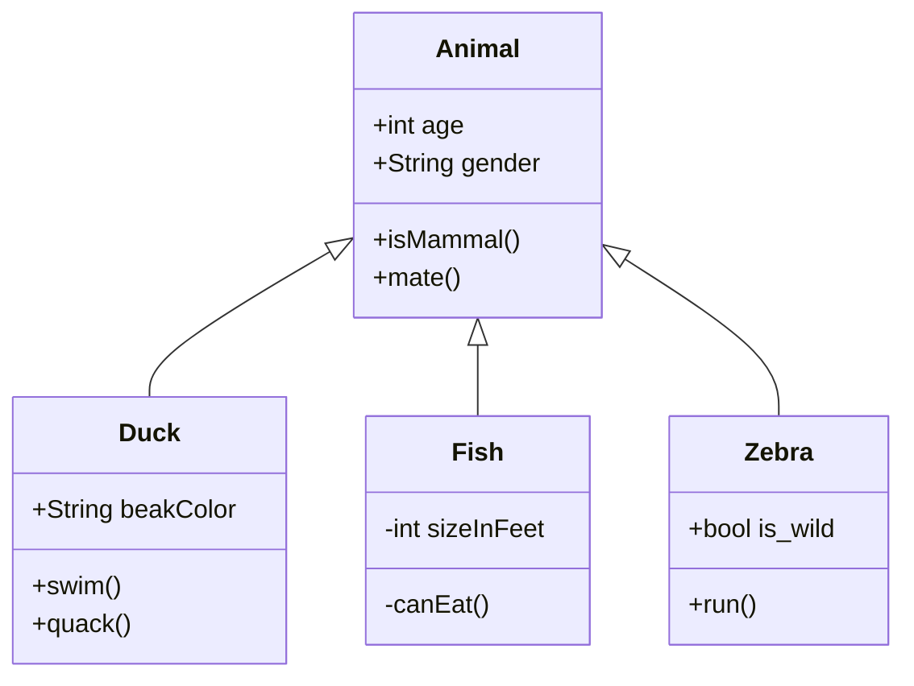

## Entity Relationship Diagram

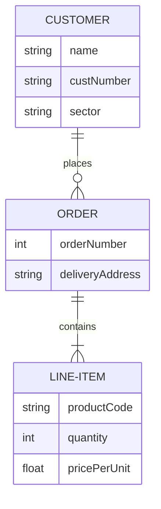

## Journey Map

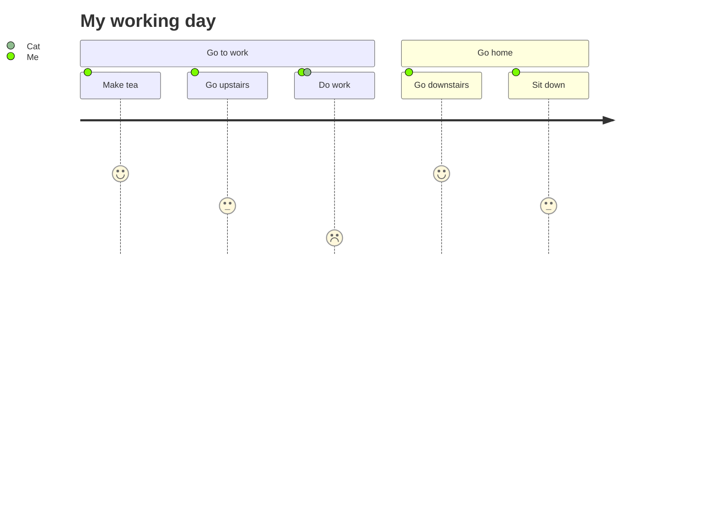

## Git Graph

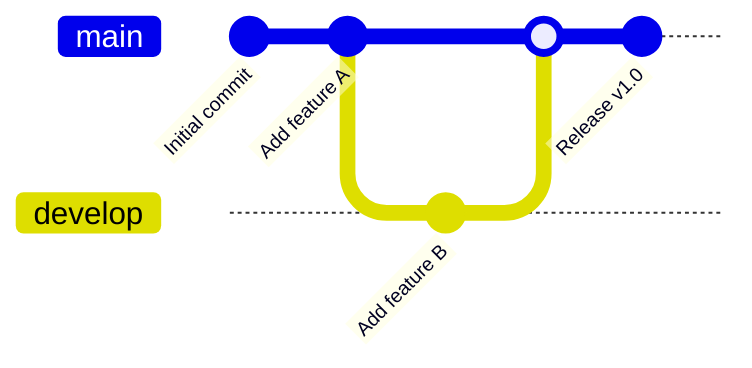

## Quadrant Chart

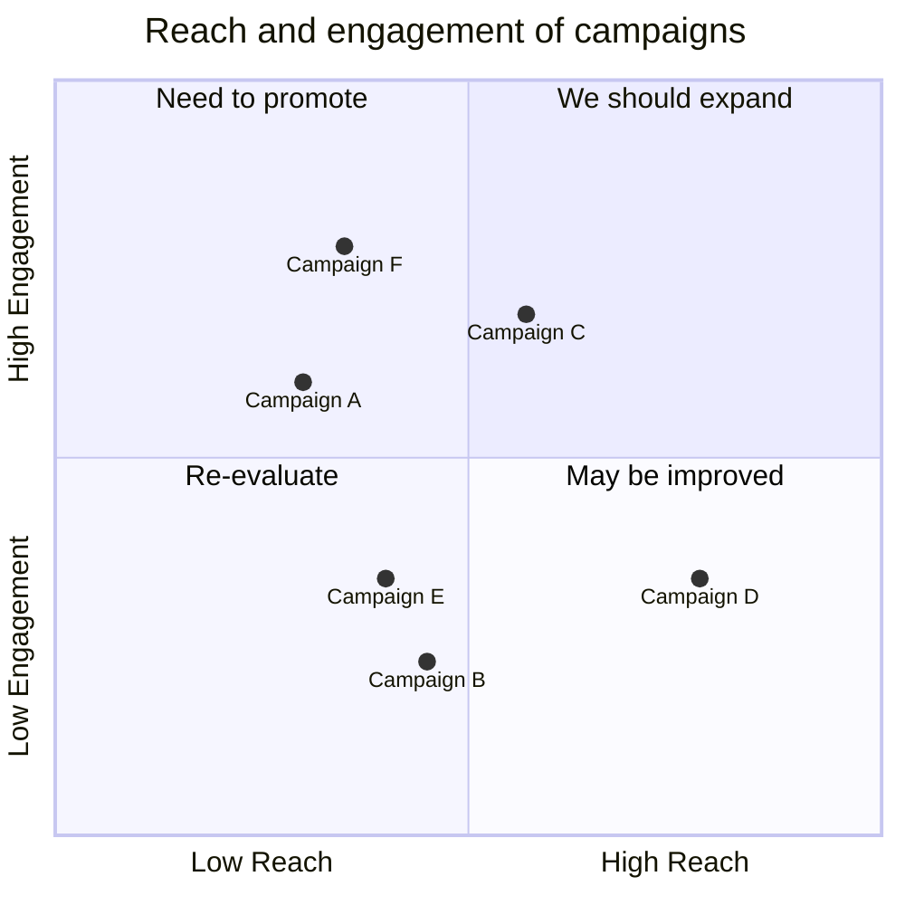

## XY Chart

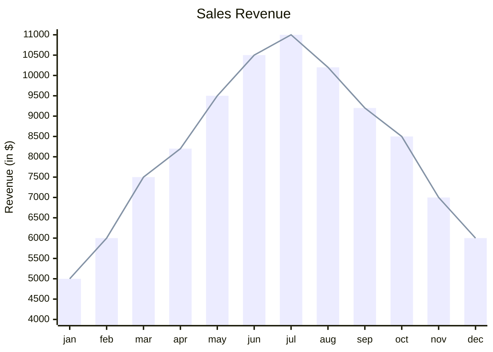

## Complex Flowchart with Subgraphs

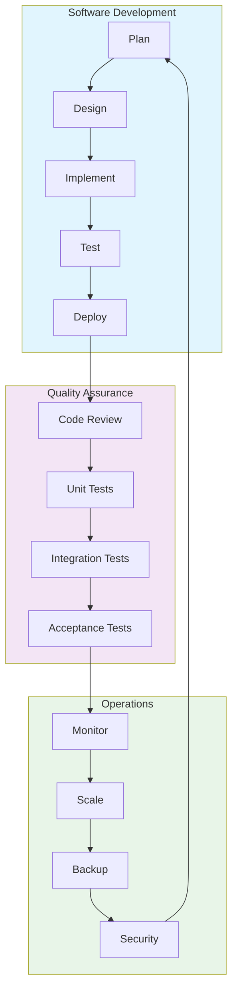
