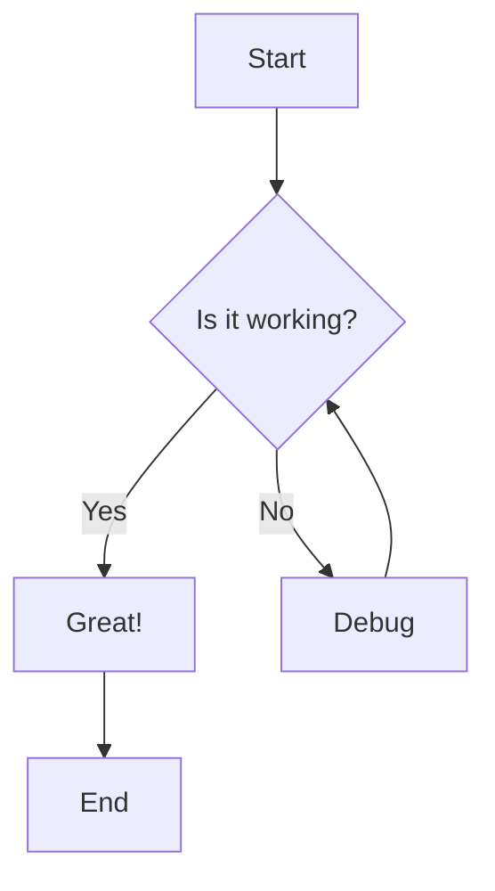
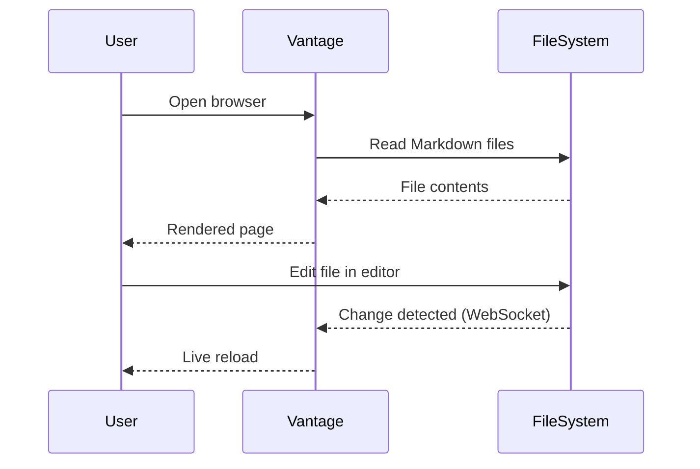

# Features

Vantage renders Markdown with the same fidelity as GitHub, plus extras like live reload and Git integration.

## GitHub Flavored Markdown

Vantage supports the full [GitHub Flavored Markdown](https://github.github.com/gfm/) specification:

- **Headings** with anchor links
- **Syntax highlighting** for fenced code blocks in 100+ languages
- **Tables** with alignment
- **Task lists** with checkboxes
- **Footnotes**
- **Strikethrough**, **bold**, _italic_
- Inline `code` and code blocks
- Blockquotes
- Ordered and unordered lists
- Horizontal rules
- Images and links
- HTML (sanitized)

### Math with KaTeX

Vantage renders LaTeX math using [KaTeX](https://katex.org/):

Inline math: `$E = mc^2$` renders as $E = mc^2$

Block math:

```
$$
\int_0^\infty e^{-x^2} dx = \frac{\sqrt{\pi}}{2}
$$
```

$$
\int_0^\infty e^{-x^2} dx = \frac{\sqrt{\pi}}{2}
$$

### Frontmatter

YAML frontmatter at the top of a file is parsed and displayed as a clean metadata table above the content:

```yaml
---
title: My Document
author: Jane Smith
date: 2026-01-15
status: Draft
---
```

## Mermaid Diagrams

Fenced code blocks with the `mermaid` language tag are rendered as diagrams. Vantage supports all Mermaid diagram types:

### Flowchart



### Sequence Diagram



### Other Diagram Types

Vantage supports flowcharts, sequence diagrams, class diagrams, state diagrams, ER diagrams, Gantt charts, pie charts, journey maps, Git graphs, quadrant charts, and more. See the [Mermaid documentation](https://mermaid.js.org/) for the full list.

Click the **maximize button** on any diagram to view it in a full-screen modal.

## Live Reload

When Vantage is running and you edit a Markdown file in your editor, the browser updates instantly — no manual refresh needed. This works through a WebSocket connection that watches the filesystem for changes.

This is especially useful when:

- **Reviewing LLM output** — watch AI-generated Markdown appear in real time
- **Editing docs** — see your formatting as you write
- **Collaborating** — changes from any source show up immediately

## Git Integration

If the directory you're serving is a Git repository, Vantage provides:

### Last Commit Info

Every file shows the most recent commit message, author, and relative timestamp (e.g., "about 2 hours ago"). Click the timestamp to view the diff.

### Commit History

Press **h** on any file to open the full commit history. Each commit shows the message, author, date, and short SHA. Click any commit to view its diff.

### Diff Viewer

The diff viewer shows changes in a unified format with:

- Added lines highlighted in green
- Removed lines highlighted in red
- Line numbers for both old and new versions
- Hunk headers showing the context

### Recent Files

The sidebar shows recently changed files (by Git commit date), so you can quickly jump to whatever was worked on most recently.

## File Tree Navigation

The sidebar displays a file tree with:

- **Lazy loading** — directories expand on click, fetching contents on demand
- **Show all folders** toggle — switch between showing only directories with Markdown files and showing everything
- **Directory viewer** — clicking a directory shows its contents in a table with commit messages and timestamps, similar to GitHub's repository view

## File Picker

Press **t** to open the fuzzy file picker. Type to search across all files in the project. Use arrow keys to navigate and Enter to select.

Press **?** to see all keyboard shortcuts, including sidebar toggle (**b**), vim-style scrolling (**j**/**k**), and quick navigation (**g h** for home, **g r** for recent files).

## Multi-Repo Mode

When running in daemon mode with multiple directories, the sidebar shows a repo selector at the top. Switch between directories without restarting the server. See [Daemon Mode](daemon-mode.md) for details.
